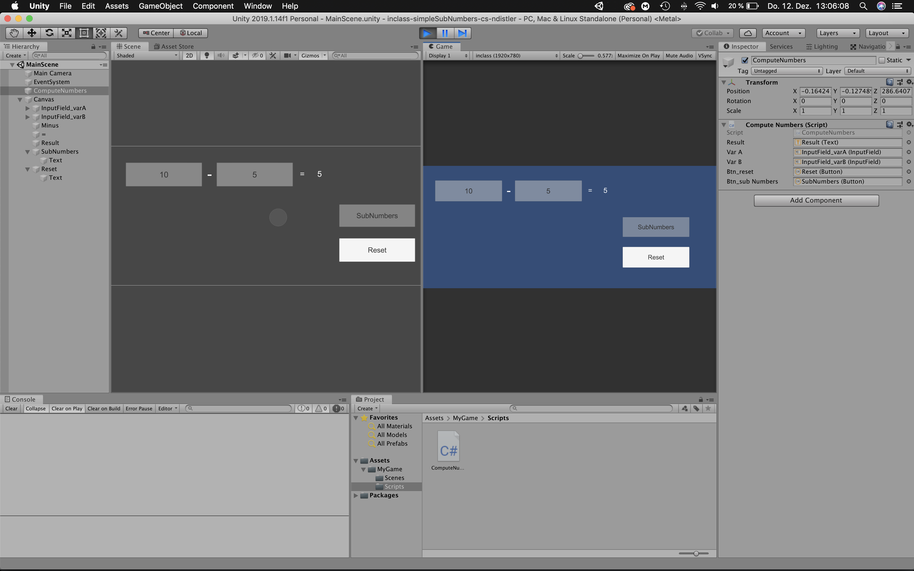

#### Simple SubNumbers README

### Project description: 
Two Input Fields with which numbers can be subtracted. 

### Development platform: 
- Mac OS Mojave 
- Unity 2019.1.14f1 
- Visual Studio Code 1.40.2

### Target platform: 
- WebGL 1920x780 

### Visuals: 

    
    

### Necessary setup/execution steps: 
–

### Third party material: 
Template: Unity2019114f1-2D-Template (Link: https://github.com/3ahmnm-htlsbg/Unity2019114f1-2D-Template)

### Project state: 
100%

### Limitations: 
None

### Lessons Learned: 
Copyright by ndistler